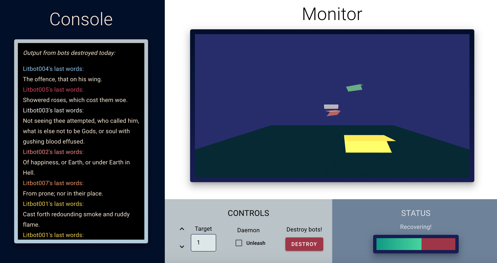

<h1 align="center">Welcome to VitalSys 👋</h1>

A system and tutorial demonstrating the capabilities of chaos engineering——a constructive and commonly used practice that originated at Netflix and has been adopted by companies like Microsoft, Facebook, and Visa. The chaos engineer brings about controlled failures to test the vulnerabilities and weaknesses of a complex, distributed system. They aim to make the system resilient enough to withstand network failures and outages that are inevitable in a massive cloud-based deployment with many moving parts and interdependencies.

This site uses Docker containers and AWS service-oriented architecture to construct a system that rebuilds itself when you break it. We've encased a flock of paper planes in an embedded VR canvas and provided a button that causes random destruction in this canvas. Each paper plane is actually a clone of our 'litbot' service, which is designed to output a Markov Chain-generated text (based on Milton's depictions of Chaos in Paradise Lost) at the moment a plane goes down. The flock of planes visualizes a system of litbot services that will replenish its number after destruction and thus remain up-and-running in spite of temporary chaos. 

Follow the tutorial on the site, wreak some chaos, and clone/adapt this repository (along with https://github.com/matthiasquintero/vitalsys-frontend) for your own projects!  

### 🏠 [Homepage](http://vital-sys.s3-website.us-east-2.amazonaws.com/)

### ✨ [Demo](http://vital-sys.s3-website.us-east-2.amazonaws.com/)

## Author

👤 **M. Milagro Quintero & Matt Reilly**

## Show your support

Give a ⭐️ if this project helped you!

